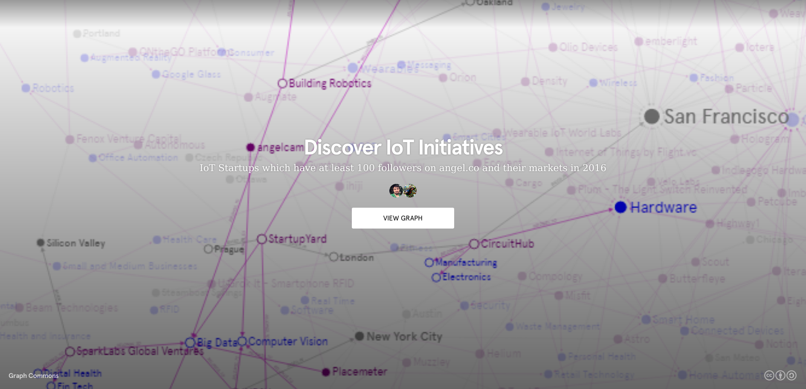
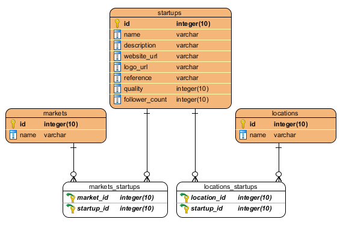

# Angel.co Startup Parser
> A project that contains two cli tool for fetchting startup datas from ancel.co
> and converts to csv files

* `angel.rb`: This CLI fetches startup datas from angel.co by given market tag
  and creates a SQLite database.
* `sqlite_to_csv_converter.rb`: This CLI creates two csv file (nodes.csv,
  edges.csv) with fetched data by `angel.rb` for use in
  [GraphCommons](https://graphcommons.com).

**Current Status: angel.co is not exposing it's api, so these tools have lost
their functionality.**

## Features
* Custom database views

## Motivation
The motivation of this project came from [PhD Aslı Boyraz
Yazagan](https://avesis.erdogan.edu.tr/asli.yazagan), a lecturer at Rize
University. She asked me to develop these tools to use in academic conference
(ICITS - [International Conference on Information Technology and
Science](http://www.icits.org/)). We used these tools to pull startups operating
in the internet of things market, other markets they are related to, and their
locations and convert them into a graph. You can see the result of the study
below:

[](https://graphcommons.com/graphs/8da5327d-7829-4dfe-b60b-4c0bda956b2a)

## Requirements
* Ruby >= 2.2.x
* Bundler(`gem install bundler`)
* See also [Gemfile](Gemfile)

## Usage
### 1. Install dependencies
```bash
$ bundler install
```
### 2. Configure
First of all, rename the following files:

* `config.example.yml` => `config.yml`
* `views.example.yml` => `views.yml` (*optional, if you want add a new database
  view(s)*)

and edit those files by yourself.

### 3. Create database
Run `ruby angel.rb -m "[Market Tag]"` or just `ruby angel.rb` command, and then
follow the steps.

### 4. Convert database to CSV files (for import GraphCommons)
```bash
$ ruby sqlite_to_csv_converter.rb -d [Database directory]
```

## Output database schema


## License
Apache 2.0
